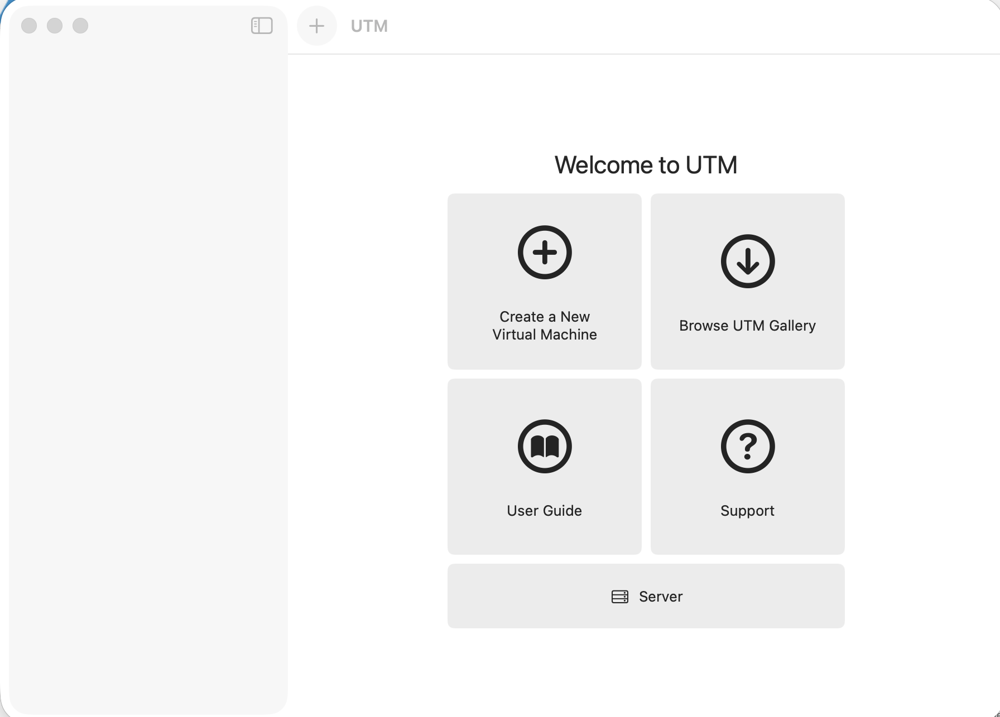
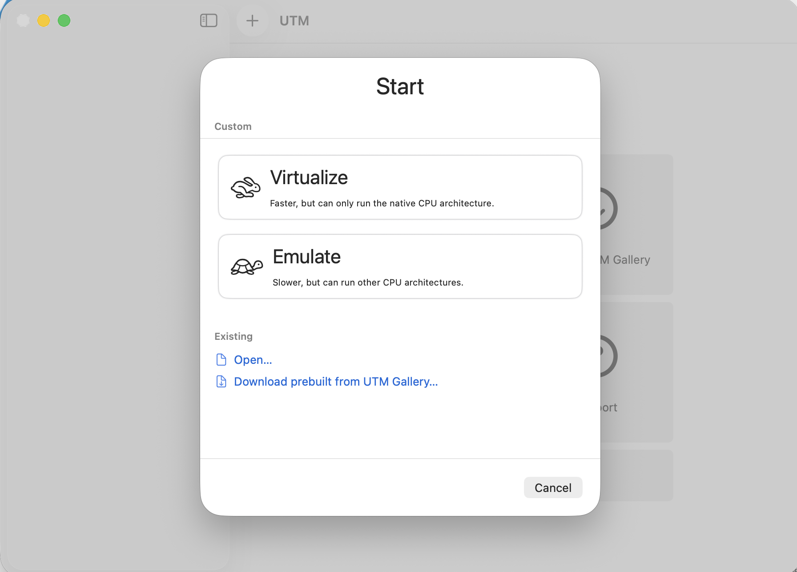
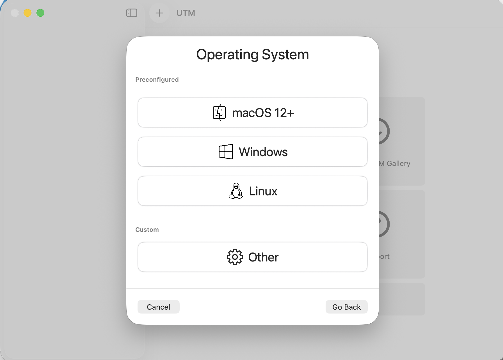
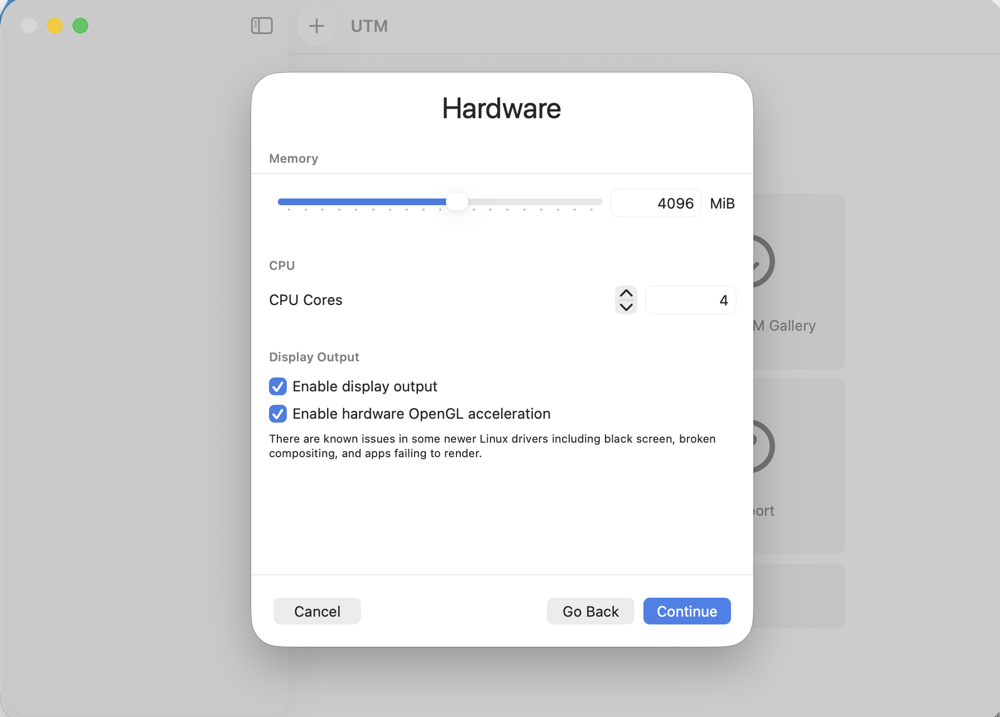
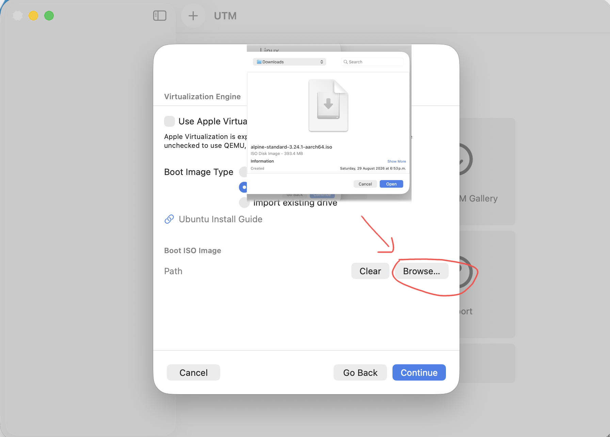

# 02 - Creating the VM
This chapter will focus on the creation of the machine inside of UTM.

> You can skip this section if you are using another virtualization software or have experience setting up virtual machines, make sure to use aarch64 and the alpine iso.

---

> To get started click "Create a New Virtual Machine"

> Then select Virtualize, as we are using the host arquitecture.

> Choose Linux.

> I gave the machine 4 Gb of memory, 4 cores, and enabled hardware OpenGL acceleration.

> Select the Alpine Live ISO as the boot image.

Don't add a shared folder for now and create the virtual disk, give the VM a name and complete the creation.

You have succesfully created the machine, now it's time to boot.