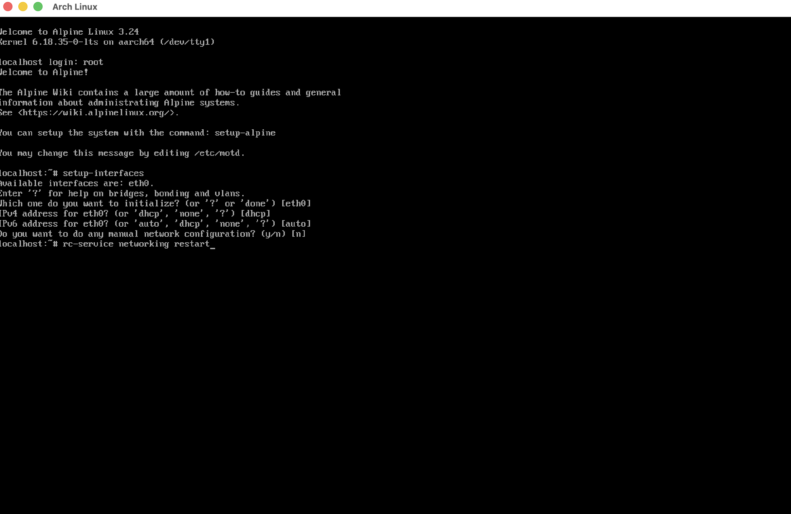

# 03 - Preparing the environment

After booting the Virtual Machine and login as root, enable networking by running:

`setup-interfaces`

Restart the OpenRC networking service:

`rc-service networking restart`

> Use the default values for setup-interfaces

Then setup the repos and select a mirror by running:

`setup-apkrepos`

## Installing packages

We'll need the following packages to set up Arch Linux:

* util-linux
* cfdisk
* dosfstools
* e2fsprogs
* libarchive-tools
* file (optional)
* nano

To install them run:
`apk add util-linux cfdisk dosfstools e2fsprogs libarchive-tools file nano`

[Next: Partitioning](https://github.com/BlackHoleMX12892/Arch-Linux-on-Apple-Silicon/tree/main/04-partitioning)
