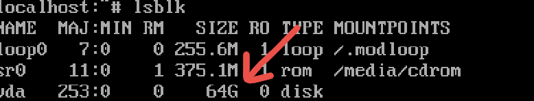
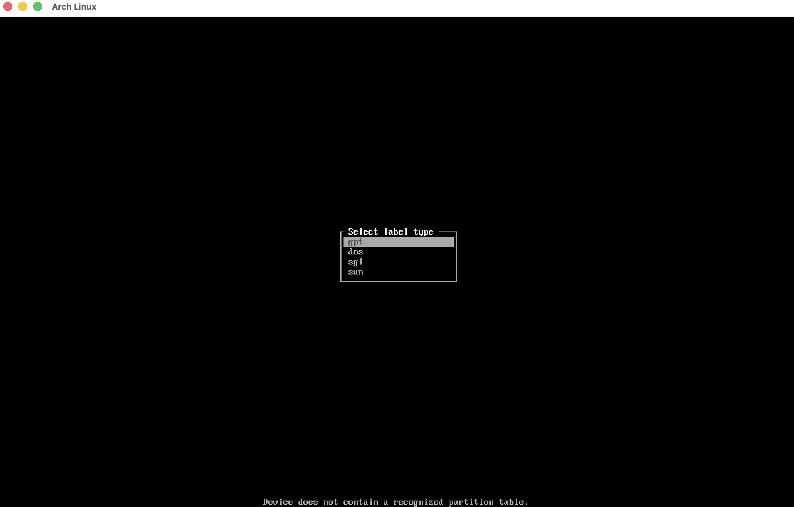

# 04 - Partitioning

Check your disks by running:

`lsblk`

> Find the name of the disk with the size you provided while setting up the machine, in this case: vda

We'll now use cfdisk to partition the disk:

`cfdisk /dev/<name of the disk here>`

Now cfdisk wil prompt for a partition table, choose GPT and press enter.

Create two partitions using the [New] option, one should be you root partition and the other a small EFI 1GB system.

Make shure to use [Type] on each partition and selecting "Linux filesystem" for the root and [EFI System] for the 1GB Partition.

Use [Write] and confirm to write the partition table, and exit by using [Exit].

Run lsblk again to find the changes.

## Formatting

> The partitions show under vda

We now have to format the partitions that show under vda, the 1GB vda1 should be FAT32 and the 63GB vda2 ext4.

Run:
`mkfs.fat -F 32 /dev/<FAT partition>`
`mkfs.ext4 /dev/<ext4 partition>`

For this layout:

`mkfs.fat -F 32 /dev/vda1`
`mkfs.ext4 /dev/vda2`

[Next: Installing Arch](https://github.com/BlackHoleMX12892/Arch-Linux-on-Apple-Silicon/tree/main/05-installing-arch)
